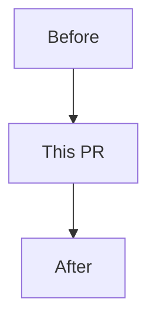

## Related Issues

<!-- 이 PR이 이슈를 닫는다면 아래처럼 반드시 GitHub closing keyword를 사용해주세요. -->

- Closes #

## 재구축 단계

<!-- 해당 없으면 `Not part of rebuild`로 적어주세요. -->

-

## 변경 사항

<!-- 사람과 agent 모두 한글로 작성해주세요. 사용자 또는 개발자가 실제로 이해해야 하는 변경을 1-5개 bullet로 요약해주세요. -->

-

## 흐름 / 의존 관계

<!-- 복잡한 흐름, route 전환, API 상태, component 의존성이 있으면 Mermaid 다이어그램을 남겨주세요. 해당 없으면 `없음`으로 적어주세요. -->

## 검증

<!-- 실행한 검증만 체크해주세요. 실패했다가 수정한 명령이 있다면 같이 적어주세요. -->

- [ ] `pnpm lint`
- [ ] `pnpm build`
- [ ] 수동 검증:

## 현재 main 동작과의 관계

<!-- 현재 main과 비교해 유지/변경/제거되는 동작을 구분해주세요. -->

- Keep:
- Change:
- Remove:

## 영향 범위

<!-- 해당 없으면 `없음`으로 적어주세요. -->

- Routes:
- Components:
- API / data fetching:
- Styling / UX:
- Config / build:

## 고민 사항

<!-- 리뷰어가 판단해야 할 설계 선택, 트레이드오프, 아직 애매한 부분을 적어주세요. agent가 작성한 PR이라면 확인한 사실과 추정한 내용을 구분해주세요. -->

-

## 후속 계획

<!-- 이 PR 이후 처리할 작업이 있으면 적어주세요. 없으면 `없음`으로 적어주세요. -->

-

## 기타

<!-- 리뷰어에게 특별히 봐줬으면 하는 파일, agent 작성 여부, 참고 문서 등을 적어주세요. -->

- 작성 주체: 사람 / 사람 + AI assistance / AI agent
- 주요 확인 파일:
- 확인하지 못한 가정:

## 체크리스트

- [ ] PR 범위가 목적에 맞게 제한되어 있습니다.
- [ ] 필요한 테스트, 문서, 설정을 함께 반영했습니다.
- [ ] secret, token, 개인정보가 포함되지 않았습니다.
- [ ] AI가 생성하거나 크게 수정한 내용은 사람이 검토했습니다.
- [ ] 재구축 작업이라면 최종 parity에 필요한 정보가 issue/PR에 남아 있습니다.
