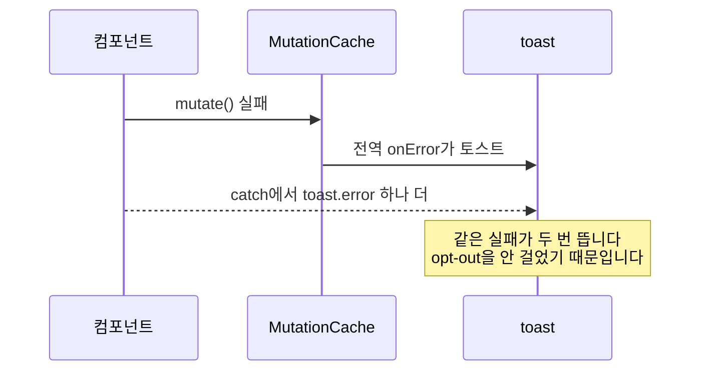

# heymoa-web 에이전트용 안내

HeyMoa의 웹 프론트엔드. Next.js 16 App Router입니다.
레포 규약(구조·명령어·문서 지도)은 [`CLAUDE.md`](CLAUDE.md)에, 항상 걸리는 규칙은
[`.claude/rules/`](harness/v001-2026-07-26/rules/)에 있습니다. 그대로 따르세요.

이 파일은 **코드 리뷰를 할 때 지킬 것**만 담습니다.
심각도 라벨과 되풀이된 결함, 출력 형식은
[`skills/code-review`](harness/v001-2026-07-26/skills/code-review/SKILL.md)에 있습니다.

## 리뷰는 한국어 존댓말로 씁니다

지적은 짧게, 근거는 구체적으로. 파일과 줄 번호를 답니다.

## 문제를 그림으로 보여주세요

흐름·구조·의존 관계가 걸린 지적은 mermaid로 그리면 한 번에 읽힙니다. 무엇이 잘못됐는지,
어디서 끊기는지를 그림에 표시해 주세요.

**출력 형식이 허용할 때만입니다.** 인라인 코멘트처럼 길이 제한이 있으면 다이어그램은 빼고
글로 짧게 씁니다 — 형식을 어기면서까지 그리지 마세요. 그림이 없을 때는 어디서 끊기는지를
파일과 줄 번호로 대신 짚습니다.

````markdown

````

| 무엇을 설명하나 | 무엇으로 |
|---|---|
| 요청이 오가는 순서, 어디서 끊기는지 | `sequenceDiagram` |
| 구조·레이어·의존 방향 | `flowchart` |
| 상태가 바뀌는 규칙 | `stateDiagram-v2` |

## 지적 하나에 이 셋을 담아주세요

1. **무엇이 잘못됐나.** 한 문장으로 씁니다
2. **어떻게 터지나.** 구체적인 입력이나 상황을 씁니다. "~할 수 있다"가 아니라 "A를 누르면 B가 된다"로
3. **왜 그렇게 되나.** 코드의 어느 줄이 원인인지 짚습니다

추측이면 추측이라고 적어주세요. 확인 안 된 지적을 단정으로 쓰면 그걸 피하는 코드가 생기고,
그건 없는 함정을 피하는 구조로 남습니다.

## 이 레포에서 자주 걸리는 것

| | |
|---|---|
| 실패와 빈 상태 | 조회 실패를 "데이터 없음"으로 그리면 사용자는 비어 있다고 믿습니다. 가장 자주 나온 지적입니다 |
| 캐시 갱신 | mutation 뒤 invalidate 대상이 좁거나 `void`로 흘려 남의 변경이 안 따라옵니다 |
| 오류 중복 | 전역 `MutationCache.onError`가 토스트합니다. 인라인으로 그릴 거면 `suppressErrorToast`로 opt-out해야 겹치지 않습니다 |
| 경계 상태 | 리소스를 떠나거나 겹쳐 조작해도 이전 상태가 남습니다. `DataBoundary`의 `resetKeys` 계열 |
| 서버/클라이언트 | `page.tsx`는 Server Component입니다. hydration 불일치를 `ssr: false`로 덮지 않습니다 |
| 목과 계약 | MSW 핸들러가 실제 계약과 다르면 화면은 되는데 실제로는 안 됩니다 |
| 한국어 | **사람에게 말을 거는 표면**(이슈·커밋·리뷰)은 존댓말입니다. 코드 주석과 `docs/` 산문의 문체는 지적 대상이 아니고, 주변 코드에 맞춥니다 |
