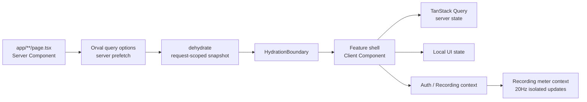
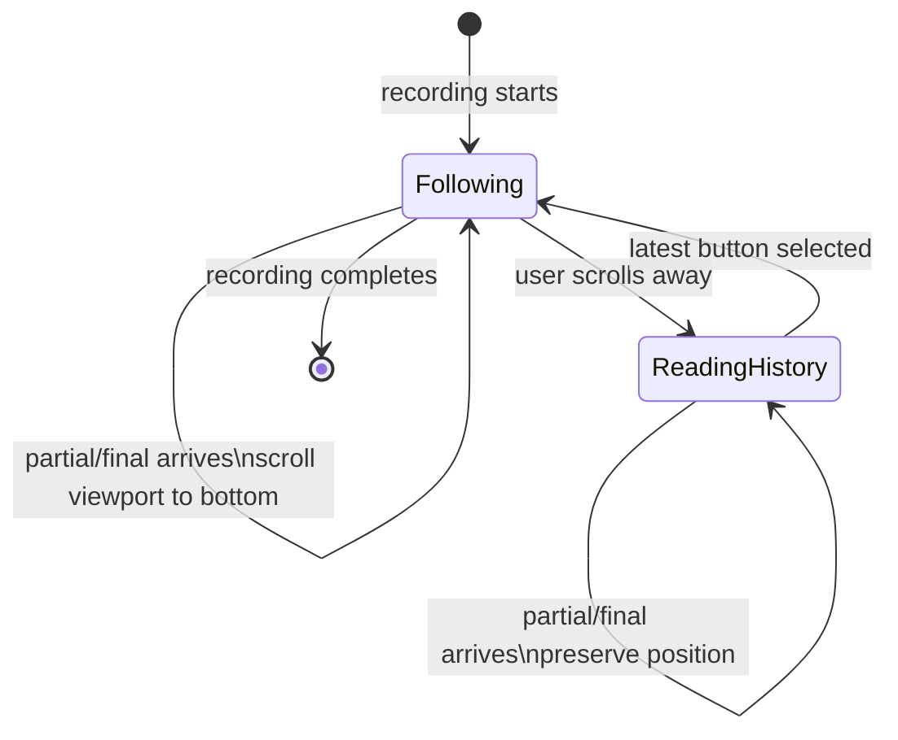

# HeyMoa 프론트엔드 아키텍처

## 목표

HeyMoa Web은 Next.js App Router의 서버 렌더링을 기본으로 사용하고, 브라우저 상호작용이 필요한 최소 경계만 Client Component로 둔다. 화면은 `DESIGN.md`의 조용한 에디토리얼 톤을 따르며, 네트워크·세션·세그먼트 같은 내부 구현 상태보다 사용자의 회의와 대화를 우선한다.

이 문서는 다음 공식 자료를 현재 프로젝트에 맞게 적용한 결정이다.

- [Next.js: Project structure](https://nextjs.org/docs/app/getting-started/project-structure)
- [Next.js: Server and Client Components](https://nextjs.org/docs/app/getting-started/server-and-client-components)
- [Next.js: Authentication](https://nextjs.org/docs/app/guides/authentication)
- [Next.js: Linking and navigating](https://nextjs.org/docs/app/getting-started/linking-and-navigating)
- [TanStack Query: Advanced Server Rendering](https://tanstack.com/query/latest/docs/framework/react/guides/advanced-ssr)
- [React: hydrateRoot](https://react.dev/reference/react-dom/client/hydrateRoot)
- [MDN: Scroll anchoring](https://developer.mozilla.org/en-US/docs/Web/CSS/Guides/Scroll_anchoring/Overview)

## 렌더링과 데이터 흐름



1. `app/`의 route 파일은 파라미터 해석, 서버 prefetch, redirect와 metadata만 담당한다.
2. 서버는 HttpOnly cookie를 전달해 Orval query options를 prefetch하고 `HydrationBoundary`로 동일한 첫 스냅샷을 브라우저에 넘긴다.
3. 상호작용, WebSocket, 마이크, viewport 판별만 Client Component에서 처리한다.
4. `ssr: false`로 전체 feature를 감싸 hydration 문제를 숨기지 않는다. 브라우저 전용 SDK 하나처럼 더 작은 경계가 불가피할 때만 사용한다.
5. 서버 상태는 TanStack Query, 입력·열림·선택 상태는 가장 가까운 component state가 소유한다.

워크스페이스처럼 여러 하위 route가 같은 사이드바·툴바·배경 목록을 공유하는 경우, 해당 셸은 `layout.tsx`가 소유한다. 노트 route는 노트 surface만 추가하며, 닫을 때 부모 셸과 목록을 다시 마운트하지 않는다.

## 폴더와 의존 방향

현재 프로젝트는 route 밖 feature 분리 전략을 사용한다.

```text
app/                    # route orchestration, layout, error/loading boundary
components/<feature>/   # auth, workspace, notes, transcription UI
components/ui/          # 제품 의미를 모르는 primitive
lib/api/generated/      # OpenAPI → Orval 생성물, 직접 수정 금지
lib/<feature>/          # 순수 selector, protocol, feature service
hooks/                  # 여러 feature가 공유하는 browser adapter
```

의존 방향은 `app → feature UI → feature logic → generated API / primitive`이다. `components/ui`는 workspace나 transcription을 import하지 않는다. 동일 API query를 여러 자식이 각각 구독해야 할 이유가 없다면 shell에서 한 번 읽고 context/props로 전달한다.

## 상태 경계

- 인증: `AuthProvider`가 사용자와 logout lifecycle을 소유한다. logout은 사용자별 Query cache를 비우고 `/`로 replace한 뒤 route를 refresh한다.
- 녹음: `RecordingProvider`는 session, phase, transcript, command를 소유한다.
- 오디오 미터: 50ms 단위 level은 `RecordingMeterContext`로 분리한다. 파형을 그리는 component만 `useRecordingMeter()`를 사용한다.
- workspace 선택: 현재 project 선택은 workspace shell의 지역 상태다. URL 공유가 필요해질 때만 search param으로 승격한다.
- 전사: 서버 segment는 영속 모델이다. UI는 `groupTranscriptSegments()`로 인접 segment를 문단으로 투영하지만 원본 ID와 session 경계는 바꾸지 않는다.

## Hydration 규칙

React의 첫 client render는 서버 HTML과 같은 결과여야 한다.

- render 중 `Math.random()`, `Date.now()`, 브라우저 locale 기본값을 사용하지 않는다.
- 날짜는 `lib/format/date.ts`와 서비스 timezone을 사용한다.
- media query는 `useSyncExternalStore`의 고정 server snapshot을 사용한다.
- Client Query가 첫 화면에 필요하면 server prefetch/dehydrate한다.
- `suppressHydrationWarning`과 `ssr: false`는 원인 해결이 아닌 escape hatch다.
- hydration 여부를 이유로 전체 화면을 두 번 렌더링하지 않는다.

## 로딩과 mutation 규칙

- route 전체 spinner보다 note list, transcript, note metadata처럼 사용자가 기다리는 단위에 skeleton/error/retry를 둔다.
- skeleton의 높이와 최종 component의 최소 높이를 맞춰 layout shift를 줄인다.
- 이미 로드된 부모 화면 위에 sheet가 열리는 흐름에서는 임시 sheet skeleton을 만들지 않는다. 부모 화면을 유지한 뒤 실제 sheet만 한 번 진입시킨다.
- mutation 버튼은 기존 label을 투명하게 유지하고 absolute spinner를 올려 폭을 보존한다.
- pending 중 같은 mutation을 시작할 수 있는 모든 control을 함께 비활성화한다.
- `isFetching`을 “저장 중”처럼 다른 의미로 번역하지 않는다. 내부 polling과 reconciliation은 사용자에게 노출하지 않는다.

## 실시간 데이터 계층

WebSocket·SSE·polling 코드는 feature마다 같은 계층을 반복한다. 기준 구현은 전사 스택이다.

```text
transport   lib/transcription/socket.ts     연결·프레이밍만 안다. React와 이벤트 의미를 모른다.
protocol    lib/transcription/protocol.ts   asyncapi 계약의 zod discriminated union. 파싱 실패는 에러다.
reducer     lib/transcription/transcript-reducer.ts  순수 함수. 이벤트 → 화면 상태.
provider    components/*/recording-provider.tsx      lifecycle 소유, TanStack Query 캐시와 연결.
```

- **transport는 공용, protocol은 feature별.** SSE-over-POST는 `lib/api/sse.ts`의 `postEventStream()`을 사용한다(네이티브 `EventSource`는 GET 전용, Orval은 스트리밍 훅을 생성하지 못한다). 인증 401 refresh는 transport가 처리하고, 이벤트 payload의 zod 파싱은 feature protocol이 담당한다. agent 챗봇 2종은 진입 URL만 다르고 같은 계층을 공유한다.
- **polling은 TanStack Query가 소유한다.** `refetchInterval` + `enabled` 게이팅으로만 폴링한다(`recording-provider` 세션 reconcile 3s, `transcript-view` 활성 전사 2.5s가 선례). 별도 타이머·폴링 추상화를 만들지 않는다.
- **영속 상태의 단일 출처는 서버다.** 실시간 이벤트는 화면을 즉시 갱신하고, 확정된 데이터는 query invalidate로 서버 응답에 수렴시킨다(final → transcript invalidate가 선례). 스트림과 폴링이 같은 상태를 이중으로 쓰지 않게 reconcile 지점을 provider 한 곳에 둔다.

## 실시간 전사 UX



- 사용자가 하단 180px 안에 있을 때만 새 발화를 따라간다.
- follow 의도는 새 DOM이 추가되기 전에 scroll listener가 보존한다.
- 사용자가 과거 내용을 읽으면 강제로 끌어내리지 않고 `최신 기록 보기`를 제공한다.
- 빠른 partial update는 즉시 이동하고, 사용자가 버튼을 선택한 경우만 부드럽게 이동한다.
- 화면에는 session 번호, segment 개수, polling 상태 대신 읽을 수 있는 대화 문단을 보여준다.

## 검증

변경 범위에 맞춰 아래를 실행한다.

1. 순수 selector와 reducer 단위 테스트
2. feature component 상호작용 테스트
3. `pnpm lint`
4. `pnpm build`
5. 인증, note surface, recording, live follow를 실제 브라우저에서 확인
