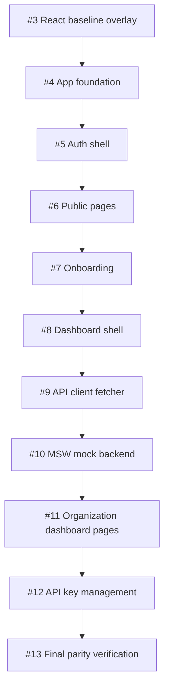
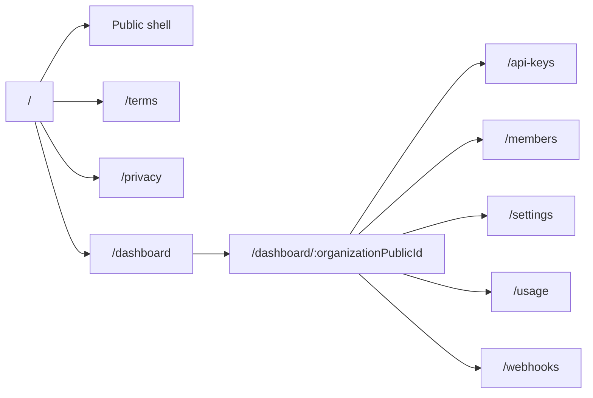

# Final Web Parity Verification

## Related Issues

- Closes #13

## Scope

This document records the final verification pass for the `realillust-web`
rebuild line on `dev`.

The rebuild intentionally restored the application in issue-linked layers:

## Verified Routes

## Verification Commands

- `pnpm format:check`
- `pnpm lint`
- `pnpm build`
- `NEXT_PUBLIC_API_MOCKING=enabled NEXT_PUBLIC_API_BASE_URL= pnpm dev --port 3001`
- `curl -I http://localhost:3001/`
- `curl -I http://localhost:3001/terms`
- `curl -I http://localhost:3001/privacy`
- `curl -I http://localhost:3001/dashboard`
- `curl -I http://localhost:3001/robots.txt`
- `curl -I http://localhost:3001/sitemap.xml`
- `curl -I http://localhost:3001/mockServiceWorker.js`

## Result

All verification commands passed on June 27, 2026.

Public routes, dashboard entry, metadata routes, build, lint, formatting, and
the MSW browser worker are functional on the rebuilt `dev` branch.

Direct organization dashboard routes remain SSR API-backed and require a real
API/session at runtime. The UI and API client contract for organization and API
key flows are present, and mock browser handlers are available for client-side
development with `NEXT_PUBLIC_API_MOCKING=enabled`.

## Follow-up

After this verification PR is merged into `dev`, create the release PR from
`dev` to `main`.
