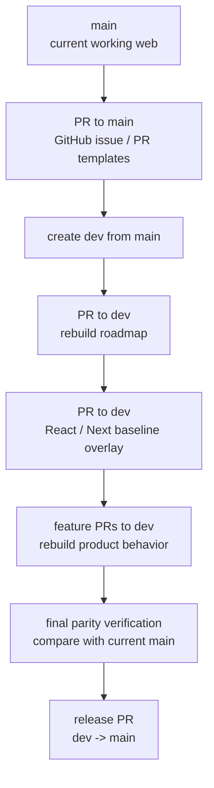
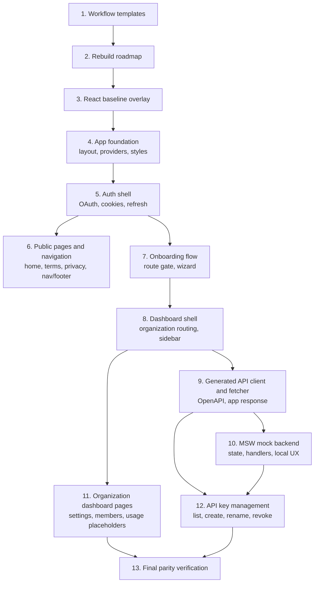
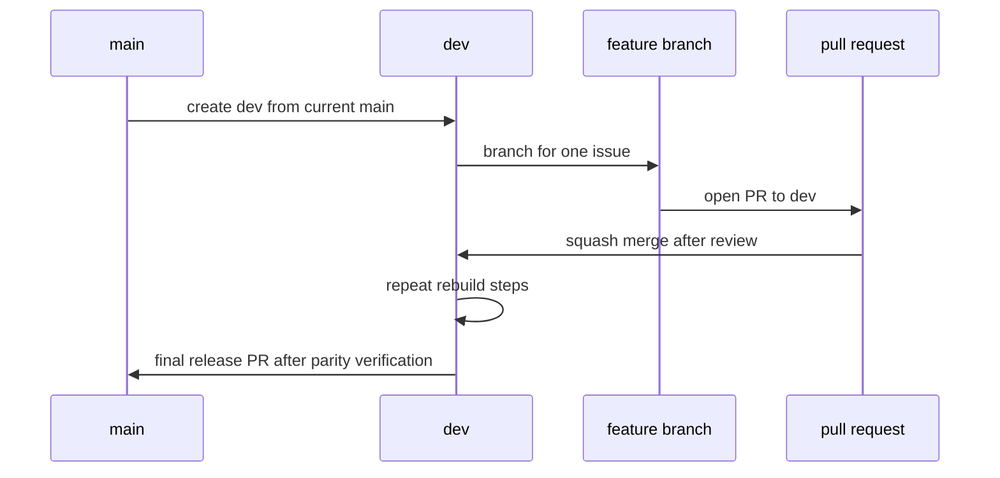

# heymoa-web Rebuild Roadmap

This document defines how `heymoa-web` will be rebuilt from a fresh React/Next baseline while preserving the existing `main` history.

The goal is not to reset git history. The goal is to create `dev` from the current `main`, overlay a clean baseline on `dev`, and rebuild the current product behavior through issue, branch, and pull request records.

## Principles

- Preserve the current `main` history.
- Create `dev` from `main` before rebuilding product code.
- Overlay the React/Next baseline as a new commit on `dev`; do not reset to an old commit.
- Create work branches from `dev` and merge back into `dev` with squash merge.
- Keep issue, branch, PR, and final squash commit names aligned.
- Intermediate rebuild steps do not need to be fully production-ready.
- The final `dev -> main` release must behave similarly to the current `main`, except for intentional cleanup or improvements recorded in issues and PRs.
- Improve weak agent-generated code while rebuilding, as long as the final behavior remains compatible with the product goal.

## Branch and PR Rules

```text
main: stable branch
dev: rebuild integration branch
type/issue/slug: short-lived branch from dev
```

Examples:

```text
chore/1/add-github-workflow-templates
docs/2/document-web-rebuild-roadmap
chore/3/overlay-react-baseline
feat/12/rebuild-api-key-management
```

PR titles should include the linked issue number:

```text
chore: add GitHub workflow templates (#1)
docs: document web rebuild roadmap (#2)
feat: rebuild API key management (#12)
```

PR bodies should include:

```md
Closes #12
```

## High-Level Flow



## Rebuild Dependency Map



## Planned Issues

The exact issue numbers will be assigned by GitHub. After each issue is created, use the assigned number in the branch name.

| Order | Type  | Title                                | Target | Notes                                                               |
| ----- | ----- | ------------------------------------ | ------ | ------------------------------------------------------------------- |
| 1     | chore | Add GitHub workflow templates        | `main` | One allowed exception before `dev`, so templates work in GitHub UI. |
| 2     | docs  | Document web rebuild roadmap         | `dev`  | This document becomes the source of truth for rebuild order.        |
| 3     | chore | Overlay React baseline               | `dev`  | Replace current product code with a clean baseline as a new commit. |
| 4     | chore | Rebuild app foundation               | `dev`  | Layout, global styles, providers, metadata, basic route structure.  |
| 5     | feat  | Rebuild auth shell                   | `dev`  | Auth provider, login button, OAuth paths, cookie refresh behavior.  |
| 6     | feat  | Rebuild public pages and navigation  | `dev`  | Home/static pages, navbar/footer gates, brand assets.               |
| 7     | feat  | Rebuild onboarding flow              | `dev`  | Onboarding route gate, wizard, submit behavior.                     |
| 8     | feat  | Rebuild dashboard shell              | `dev`  | Dashboard routing, organization selector, sidebar shell.            |
| 9     | feat  | Add generated API client and fetcher | `dev`  | OpenAPI generation, fetcher, app response handling.                 |
| 10    | feat  | Add MSW mock backend                 | `dev`  | Mock state and handlers for local rebuild verification.             |
| 11    | feat  | Rebuild organization dashboard pages | `dev`  | Organization settings, member, usage, webhook placeholder pages.    |
| 12    | feat  | Rebuild API key management           | `dev`  | List, create, secret display, rename, revoke, filters.              |
| 13    | test  | Verify final web parity              | `dev`  | Confirm rebuilt `dev` behaves similarly to current `main`.          |

## Current Main Capability Inventory

The rebuild should preserve or intentionally improve these current capabilities:

- Next.js app shell with global providers and error/not-found handling.
- Public/static routes and shared navigation/footer behavior.
- Google OAuth entry points and cookie-based auth state.
- Auth refresh and unauthenticated state handling.
- Onboarding route and profile wizard.
- Dashboard entry route that redirects to the first organization.
- Organization-scoped dashboard layout and sidebar navigation.
- Organization settings and placeholder dashboard sections.
- Generated OpenAPI client and shared fetch response handling.
- MSW-backed local mock API behavior.
- API key dashboard with list, create, rename, revoke, and status filtering.

## Final Parity Checklist

Before opening the final `dev -> main` release PR:

- Run `pnpm lint`.
- Run `pnpm build`.
- Verify public pages render.
- Verify auth UI states and OAuth links.
- Verify onboarding redirect and submission behavior.
- Verify dashboard organization routing.
- Verify organization settings update behavior.
- Verify API key list, create, rename, revoke, and filtering behavior.
- Verify mock mode still supports local flows when enabled.
- Record any intentional behavior changes in the release PR.

## Release Shape


