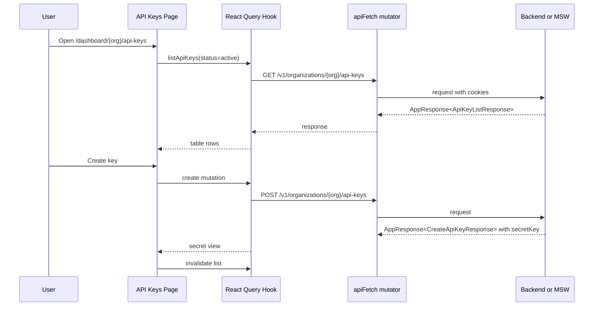

# API Key Frontend Design

## Context

`heymoa-server` now exposes organization-owned API key management endpoints. The frontend currently has a dashboard shell and an API Keys navigation item, but `/dashboard/{organizationPublicId}/api-keys` still renders a coming-soon panel.

The API key backend contract supports:

- Listing keys by status under an organization.
- Creating a key and returning the raw `secretKey` only once.
- Renaming a key.
- Revoking a key with a revoke-only lifecycle.
- Returning list rows with `maskedKey`, `status`, `createdAt`, `lastUsedAt`, and `createdBy`.

This design implements the API Keys dashboard page and also replaces the current petstore Orval sample with a Heymoa OpenAPI-based frontend contract. The OpenAPI, Orval, MSW, and faker setup should make dashboard development and browser verification possible without running the backend or passing through Google OAuth2.

## Goals

- Build an OpenAI-like API key management page for organizations.
- Show the raw secret only immediately after creation, then rely on `maskedKey`.
- Support Active, Revoked, and All filters, defaulting to Active.
- Support rename and revoke actions.
- Require a confirmation dialog before revoke.
- Use `DESIGN.md` dashboard styling and existing shadcn-style local UI primitives where practical.
- Introduce `openapi3.yml` as the frontend API contract source.
- Generate typed React Query clients and models with Orval.
- Add MSW/faker-backed mocks for the dashboard APIs needed to run the page without a backend.

## Non-Goals

- No API key permission editor.
- No quota, rate-limit, or spend controls.
- No usage chart integration.
- No public API request builder.
- No sandbox mode.
- No full OAuth2 simulation in mock mode.
- No required Playwright suite in this feature. The MSW setup must make Playwright coverage straightforward later.

## User Experience

### Page Layout

`/dashboard/{organizationPublicId}/api-keys` shows:

- Page title: `API Keys`.
- Short dashboard-oriented description.
- Primary `Create API key` button.
- Status filter using a segmented control or toggle group: `Active`, `Revoked`, `All`.
- A table of keys.

The table columns are:

- `Name`
- `Secret key`
- `Status`
- `Created`
- `Last used`
- `Created by`
- `Actions`

`Secret key` always displays `maskedKey`, for example `sk_live_...r4A9`. `Last used` displays `Never` when null. `Created by` displays the user name when present and falls back to `User #{id}`.

### Create Flow

Clicking `Create API key` opens a dialog. The first state contains an optional name input and create/cancel actions. On success, the same dialog changes into a one-time secret view:

- Shows the raw `secretKey`.
- Provides a copy button.
- Shows a warning that the secret cannot be viewed again.
- Allows the user to close the dialog after copying.

When the dialog closes, the raw secret is removed from component state. The table is refreshed and only `maskedKey` remains visible.

### Rename Flow

Each row has a rename action. Clicking it opens a small dialog with a name input and save/cancel actions. On success, the current list query is invalidated. Rename is allowed for both active and revoked keys, matching the backend lifecycle design.

### Revoke Flow

Active rows have a revoke action. Clicking it opens a confirmation dialog that clearly states the key cannot be reactivated. Confirming calls the revoke endpoint, then refreshes the list. Revoked rows do not show an active revoke command.

## Architecture

### Page Boundary

`app/dashboard/[organizationPublicId]/api-keys/page.tsx` remains a small server component. It reads `organizationPublicId` from route params and renders `ApiKeysManager`.

`ApiKeysManager` owns:

- The selected status filter.
- Query hook invocation.
- Create, rename, and revoke mutation wiring.
- Dialog open/close state.
- Query invalidation after mutations.

This page intentionally uses client-side data fetching because the feature is mutation-heavy and must handle one-time secret display, copy interaction, and modal state.

### Components

Create dashboard-scoped components under `app/dashboard/[organizationPublicId]/api-keys/`:

- `ApiKeysManager`
- `ApiKeysTable`
- `CreateApiKeyDialog`
- `RenameApiKeyDialog`
- `RevokeApiKeyDialog`

The components should remain focused:

- Table components render data and action triggers.
- Dialog components own form state and inline mutation errors.
- The manager coordinates server state through TanStack Query.

### UI Primitives

Use existing local shadcn-style primitives first:

- `Button`
- `Badge`
- `ToggleGroup`
- `DropdownMenu` if row actions need a menu

If dialog/input/table primitives are missing, add them through the same shadcn-style local component pattern used in `components/ui`. Styling must follow `DESIGN.md`: cream canvas, hairline borders, restrained dashboard density, and no decorative marketing layout.

## API Contract

Add `openapi3.yml` in the frontend repo as the source for Orval. The initial contract should include the dashboard APIs required by existing and new screens:

- `GET /v1/users/me`
- `POST /v1/auth/refresh`
- `POST /v1/auth/logout`
- `GET /v1/organizations`
- `GET /v1/organizations/{organizationPublicId}`
- `PATCH /v1/organizations/{organizationPublicId}`
- `GET /v1/organizations/{organizationPublicId}/members`
- `GET /v1/organizations/{organizationPublicId}/api-keys`
- `POST /v1/organizations/{organizationPublicId}/api-keys`
- `PATCH /v1/organizations/{organizationPublicId}/api-keys/{keyId}`
- `POST /v1/organizations/{organizationPublicId}/api-keys/{keyId}/revoke`

The OpenAPI schemas must model the backend app response envelope:

```ts
type AppResponse<T> = {
  success: boolean;
  data: T | null;
  error: { code: string; message: string } | null;
};
```

API key schemas:

- `ApiKeyListResponse`: `{ items: ApiKeyResponse[] }`
- `ApiKeyResponse`: `id`, `name`, `maskedKey`, `status`, `createdAt`, `lastUsedAt`, `createdBy`
- `CreateApiKeyRequest`: optional `name`
- `CreateApiKeyResponse`: `id`, `name`, `secretKey`, `maskedKey`, `status`, `createdAt`
- `UpdateApiKeyRequest`: `name`

`status` query values are `active`, `revoked`, and `all`. Unknown values are not a UI state; the UI should only send the three supported values.

## Orval Strategy

Replace the petstore `orval.config.ts` target with `./openapi3.yml`.

Generate:

- React Query hooks.
- TypeScript models.
- MSW mock handlers.

Continue using `lib/api/fetcher.ts` as the custom fetch mutator so cookie credentials, refresh/retry behavior, and auth state notification remain centralized. If Orval's generated response shape exposes more envelope detail than the UI should know about, add thin feature wrappers that unwrap `AppResponse<T>` and throw user-facing errors.

The generated files stay under `lib/api/generated`. They are generated artifacts and should not be edited by hand.

## Mock Strategy

Add MSW and faker as development dependencies. Mock mode is enabled by an explicit environment flag:

```bash
NEXT_PUBLIC_API_MOCKING=enabled
```

When enabled in the browser, the app starts the MSW worker before dashboard API calls run. The mock setup should provide enough backend behavior to use the dashboard without a real server:

- `GET /v1/users/me` returns a signed-in owner user.
- `POST /v1/auth/refresh` succeeds.
- `POST /v1/auth/logout` succeeds.
- Organization list/detail endpoints return at least one organization.
- Members endpoint returns stable member rows.
- Organization rename updates mock state.
- API key list/create/rename/revoke endpoints are stateful.

Generated Orval mocks can provide baseline handlers, but API key and organization handlers should be customized where stateful behavior matters. Creating an API key should generate a `sk_live_` secret with faker or a deterministic helper, store only its masked form in mock state, and return the raw `secretKey` only in the create response.

Mock auth does not reproduce Google OAuth2. In mock mode, the dashboard behaves as if an owner is already authenticated. This is intentional so browser inspection and future Playwright tests can focus on dashboard behavior rather than external auth.

## Data Flow



## Error Handling

List query failures render an inline table-level error with a retry action. Mutation failures stay in the relevant dialog so the user does not lose context. Validation should prevent empty required rename values in the UI, while backend errors remain the source of truth.

Generated or wrapper code should convert backend error envelopes into `Error` objects with readable messages. Authentication failures continue through the existing `apiFetch` refresh/retry flow and auth state notification.

## Testing And Verification

Required verification for implementation:

- `pnpm orval`
- `pnpm lint`
- `pnpm format:check`
- `pnpm build`
- Manual browser verification with `NEXT_PUBLIC_API_MOCKING=enabled pnpm dev`

Manual browser verification should cover:

- Dashboard opens without backend.
- API Keys page loads active keys.
- Status filter changes list contents.
- Create dialog shows the secret once.
- Closing create dialog removes raw secret from the screen.
- Rename updates the row.
- Revoke requires confirmation and moves the key to revoked state.

Future Playwright tests can reuse the MSW mock mode for this same flow.

## Implementation Latitude

The implementation may choose the exact dialog primitive details based on the existing shadcn-style component patterns, but it must preserve the flows, API contract, mock behavior, and verification requirements above.
