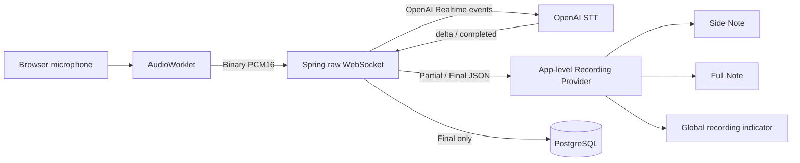

# HeyMoa 기본 회의록 API·실시간 전사 계약 설계

## 1. 목표

서버 구현 전에 `heymoa-web`에서 기본 회의록 MVP의 계약과 사용자 흐름을 검증한다.

- REST 계약은 `openapi3.yml`에 정의한다.
- Orval로 TypeScript 모델, TanStack Query client, MSW handler, Faker factory를 생성한다.
- raw WebSocket 계약은 별도 `asyncapi.yml`에 정의한다.
- MSW의 WebSocket API와 Faker로 Spring·OpenAI가 없는 상태에서도 실시간 전사 흐름을 확인한다.
- 향후 Spring Kotlin 서버가 두 명세를 구현할 수 있을 만큼 리소스, 메시지, 오류 및 생명주기를 명확히 한다.

## 2. MVP 범위

### 포함

- 기존 Google OAuth2 로그인, access token cookie, refresh token cookie
- 최초 가입 시 사용자 이름으로 기본 Workspace 자동 생성
- 가입 사용자를 해당 WorkspaceMember로 자동 등록
- 기본 Workspace 조회
- Note 생성, 조회, 수정, 삭제 및 cursor 목록
- Folder 생성, 조회, 이름 변경, 삭제
- Note와 Folder의 N:M 연결과 해제
- Note에 귀속되는 실시간 전사 Session 생성과 조회
- raw WebSocket을 통한 binary audio 송신 및 실시간 Partial/Final 수신
- 확정된 TranscriptSegment 조회와 삭제
- 앱 전역 녹음 상태와 페이지 이동 중 연결 유지
- 사용자 계정당 활성 TranscriptionSession 한 개

### 제외

- Workspace 생성, 전환, 수정, 삭제
- WorkspaceMember 목록, 초대, 역할 및 권한 관리
- private/team visibility
- 회의 참여자와 화자 관리
- Folder 색상, 아이콘, 중첩 및 수동 정렬
- TranscriptSegment 수정
- AI 문서, 요약, 액션 아이템, 템플릿 및 챗봇
- 녹음 원본 파일 저장
- 여러 STT provider와 여러 동시 활성 전사
- Spring 서버와 OpenAI adapter 구현

모든 Note는 Workspace 소유이며 해당 WorkspaceMember에게 공개된다. Folder는 권한이나 디렉터리가 아닌 N:M 분류 수단이다.

## 3. 계약 분리

### 3.1 REST

`openapi3.yml`은 영속 리소스와 명확한 요청/응답이 필요한 업무 명령을 정의한다.

- User와 인증 상태
- 기본 Workspace
- Note와 Folder CRUD
- FolderNote 연결
- TranscriptionSession 생성·조회
- connection ticket 발급
- 저장된 TranscriptSegment 조회·삭제

Orval은 이 명세만 입력으로 받아 TanStack Query client와 HTTP MSW/Faker 코드를 생성한다. Google OAuth 시작 endpoint는 fetch가 아니라 browser navigation이므로 Orval hook 대상으로 만들지 않는다.

### 3.2 raw WebSocket

`asyncapi.yml`은 현재 전사 연결에 속하는 메시지를 정의한다.

- binary PCM audio frame
- pause, resume, turn commit, complete command
- session status
- Partial/Final transcript event
- heartbeat와 오류
- WebSocket handshake, ticket query, close code

AsyncAPI에서 직접 Orval 코드를 생성하지 않는다. Next.js WebSocket client와 MSW WebSocket handler는 명세를 기준으로 직접 작성한다.

## 4. 런타임 아키텍처



- Browser는 native WebSocket을 사용한다.
- Spring Kotlin은 Browser WebSocket과 OpenAI WebSocket을 중계하고 권한, 상태 및 저장을 책임진다.
- Partial은 연결 상태이며 DB에 저장하지 않는다.
- Spring이 OpenAI `completed`를 받아 저장한 Final Segment만 영속 원본이다.
- 일반 페이지 이동과 side/full 전환은 Recording Provider를 unmount하거나 socket을 닫지 않는다.

## 5. 페이지와 URL

### 5.1 페이지

| URL | 역할 | 주요 계약 |
| --- | --- | --- |
| `/` | 랜딩과 로그인 모달 | Google OAuth browser redirect |
| `/auth/callback` | 로그인 확인과 기본 Workspace 이동 | Current User, Default Workspace |
| `/w/{workspaceId}` | 날짜 기반 Note 목록과 Folder filter | Workspace, Note list, Folder list |
| `/w/{workspaceId}/notes/{noteId}` | Note side/full 화면 | Note detail, Session, Segment, WebSocket |

### 5.2 Note 화면 query

Note의 식별은 path가 담당하고 화면 표현은 query가 담당한다.

```text
/w/{workspaceId}/notes/{noteId}?view=side&tab=transcript
/w/{workspaceId}/notes/{noteId}?view=full&tab=details
```

- `view`: `side | full`, 기본값 `full`
- `tab`: `details | transcript`, 기본값 `transcript`
- 확대와 축소는 `view`만 변경한다.
- 탭 전환은 `tab`만 변경한다.
- Side Note 닫기는 `/w/{workspaceId}`로 이동한다.
- 잘못된 query 값은 기본값으로 정규화한다.
- 향후 AI 문서 기능은 pathname 변경 없이 `tab=document`로 확장할 수 있다.

## 6. 식별자와 시간

- 모든 Entity PK는 서버에서 생성하는 TSID String이다.
- URL, API request/response 및 외부 event의 리소스 ID도 TSID String이다.
- DB ID column은 `VARCHAR(13)`이다.
- OpenAPI와 AsyncAPI는 재사용 가능한 `Tsid` schema를 둔다.

```yaml
Tsid:
  type: string
  minLength: 13
  maxLength: 13
  pattern: '^[0-9A-HJKMNP-TV-Z]{13}$'
```

- 서버 시간 타입은 Kotlin `Instant`다.
- 외부 계약에서는 RFC 3339 UTC 문자열인 `type: string`, `format: date-time`으로 표현한다.
- 오디오 위치는 절대 시각이 아니라 integer millisecond offset으로 표현한다.

## 7. 최소 도메인

### 7.1 Workspace

- `workspaceId: Tsid`
- `name: string`

최초 Google 가입 transaction에서 `{사용자 이름}의 워크스페이스`를 만들고 사용자를 WorkspaceMember로 등록한다. WorkspaceMember와 Account/Session은 MVP 공개 API를 제공하지 않는다.

### 7.2 Folder

- `folderId: Tsid`
- `name: string`

Workspace 안에서 이름은 유일하다. 삭제 시 `folder_notes` 연결만 삭제하고 Note는 유지한다.

- 이름은 앞뒤 공백 제거 후 1~50자다.
- MVP의 중복 검사는 공백 제거 후 대소문자를 구분하는 완전 일치 기준이다.

### 7.3 Note

- `noteId: Tsid`
- `title: string`
- `context: string | null`
- `createdBy: UserSummary`
- `folders: FolderSummary[]`
- `createdAt: Instant`
- `updatedAt: Instant`

빈 Note를 먼저 생성한 뒤 그 Note에서 전사를 시작한다. Workspace의 기록 시작 버튼도 Note 생성 후 Note 화면으로 이동하는 흐름이다.

- title은 앞뒤 공백 제거 후 1~200자다. 생성 요청에서 생략하면 서버가 `제목 없는 노트`를 사용한다.
- context는 null 또는 최대 4,000자다.
- Note 삭제는 hard delete이며 `folder_notes`, TranscriptionSession 및 TranscriptSegment를 같은 transaction에서 함께 삭제한다.

Note 목록 전용 DTO에는 저장 필드가 아닌 계산값을 포함한다.

- `lastRecordedAt: Instant | null`
- `recordedDurationMs: integer`

`lastRecordedAt`은 가장 최근 Session의 `startedAt`이다. `recordedDurationMs`는 Session별 마지막 Segment `endedAtMs`를 합산한 전사 timeline 길이다. Note 목록은 `lastRecordedAt`이 있으면 그 값, 없으면 `createdAt`을 정렬 key로 사용해 내림차순 정렬한다. cursor는 정렬 key와 `noteId`를 함께 인코딩하여 같은 시각의 순서를 안정화한다.

### 7.4 TranscriptionSession

- `sessionId: Tsid`
- `noteId: Tsid`
- `status: TranscriptionSessionStatus`
- `language: string | null`
- `startedBy: UserSummary`
- `startedAt: Instant`
- `endedAt: Instant | null`

```text
CONNECTING → STREAMING ↔ PAUSED → FINALIZING → COMPLETED
                     ↘ INTERRUPTED
CONNECTING/STREAMING/FINALIZING → FAILED
```

- pause와 resume은 같은 application session을 유지한다.
- pause 시 audio capture를 멈추고 남은 provider buffer를 commit한다.
- stop은 `FINALIZING`에서 마지막 Final을 저장한 뒤 `COMPLETED`가 된다.
- provider idle timeout이나 복구 불가능한 연결 장애는 `INTERRUPTED`로 종료한다.
- 종료 후 다시 기록하면 새로운 TranscriptionSession을 만든다.
- 활성 상태는 `CONNECTING`, `STREAMING`, `PAUSED`, `FINALIZING`이다.
- 동일 User에게 활성 Session이 있으면 두 번째 생성 요청을 거부한다.
- language는 ISO 639-1 code이며 null이면 자동 감지다. MVP mock 시나리오는 `ko`, `en`, null을 제공한다.

### 7.5 TranscriptSegment

- `segmentId: Tsid`
- `sessionId: Tsid`
- `sequence: integer`
- `text: string`
- `startedAtMs: integer`
- `endedAtMs: integer`

OpenAI provider item ID는 외부에 노출하지 않지만 서버 내부에 보존하고 `(transcription_session_id, provider_item_id)` unique constraint로 Final 저장을 멱등 처리한다. 사용자는 Segment를 삭제할 수 있지만 수정할 수 없다.

Segment 삭제는 hard delete다. Note 전체 script는 Session `startedAt` 오름차순, 같은 Session 안에서는 `sequence` 오름차순으로 정렬한다. sequence의 빈 값은 삭제 이력으로 허용하고 재번호를 부여하지 않는다.

## 8. REST API

| Method | Path | 역할 |
| --- | --- | --- |
| GET | `/v1/users/me` | 현재 User |
| POST | `/v1/auth/refresh` | 인증 cookie 갱신 |
| POST | `/v1/auth/logout` | 로그아웃 |
| GET | `/v1/workspaces/default` | 기본 Workspace |
| GET | `/v1/workspaces/{workspaceId}` | Workspace 상세 |
| GET | `/v1/workspaces/{workspaceId}/notes` | Note cursor 목록 |
| POST | `/v1/workspaces/{workspaceId}/notes` | 빈 Note 생성 |
| GET | `/v1/notes/{noteId}` | Note 상세 |
| PUT | `/v1/notes/{noteId}` | title/context 전체 갱신 |
| DELETE | `/v1/notes/{noteId}` | Note 삭제 |
| GET | `/v1/workspaces/{workspaceId}/folders` | Folder 목록 |
| POST | `/v1/workspaces/{workspaceId}/folders` | Folder 생성 |
| PUT | `/v1/folders/{folderId}` | Folder 이름 변경 |
| DELETE | `/v1/folders/{folderId}` | Folder 삭제 |
| PUT | `/v1/notes/{noteId}/folders/{folderId}` | Folder 연결 |
| DELETE | `/v1/notes/{noteId}/folders/{folderId}` | Folder 연결 해제 |
| POST | `/v1/notes/{noteId}/transcription-sessions` | Session과 최초 ticket 생성 |
| GET | `/v1/notes/{noteId}/transcription-sessions` | Note Session 이력 |
| GET | `/v1/transcription-sessions/{sessionId}` | Session 상태 |
| GET | `/v1/transcription-sessions/active` | 현재 User의 활성 Session |
| POST | `/v1/transcription-sessions/{sessionId}/connection-ticket` | 재접속 ticket 발급 |
| GET | `/v1/notes/{noteId}/transcript-segments` | Note Final Segment 목록 |
| DELETE | `/v1/transcript-segments/{segmentId}` | Segment 삭제 |

Note 목록은 `cursor`, `limit`, 선택적 `folderId`를 받는다. `limit` 기본값은 20이고 최대값은 100이다. Session과 Segment 목록도 cursor pagination을 사용한다.

Folder 연결 `PUT`과 연결 해제 `DELETE`는 이미 원하는 상태여도 성공하는 멱등 operation이다. Note와 Folder가 서로 다른 Workspace에 속하면 `403 FORBIDDEN`을 반환한다.

삭제 응답은 JSON parsing 경로를 통일하기 위해 `200 AppResponse_Unit`을 사용한다.

## 9. REST 응답과 오류

기존 `AppResponse`, `AppErrorBody`, `AppErrorDetail`, `AppErrorType` 계약을 확장한다.

```json
{
  "success": false,
  "error": {
    "code": "ACTIVE_TRANSCRIPTION_SESSION_EXISTS",
    "message": "이미 진행 중인 전사 세션이 있습니다.",
    "details": null
  }
}
```

| HTTP | Error code |
| --- | --- |
| 400 | `BAD_REQUEST` |
| 401 | `UNAUTHORIZED` |
| 403 | `FORBIDDEN` |
| 404 | `WORKSPACE_NOT_FOUND` |
| 404 | `NOTE_NOT_FOUND` |
| 404 | `FOLDER_NOT_FOUND` |
| 404 | `TRANSCRIPTION_SESSION_NOT_FOUND` |
| 404 | `TRANSCRIPT_SEGMENT_NOT_FOUND` |
| 409 | `FOLDER_NAME_ALREADY_EXISTS` |
| 409 | `ACTIVE_TRANSCRIPTION_SESSION_EXISTS` |
| 409 | `INVALID_TRANSCRIPTION_SESSION_STATE` |
| 503 | `STT_PROVIDER_UNAVAILABLE` |
| 500 | `INTERNAL_SERVER_ERROR` |

각 성공 data type에는 현재 명명 방식대로 명시적인 `AppResponse_*` schema를 둔다. 성공 시 `data`, 실패 시 `error`를 사용하며 `success`는 항상 required다.

## 10. WebSocket handshake와 인증

```text
WS /v1/transcription-sessions/{sessionId}/stream?ticket={singleUseTicket}
```

1. access/refresh cookie 인증을 사용하는 REST로 Session을 만든다.
2. 성공 응답은 `session`, ticket을 포함한 `socketUrl`, 짧은 수명의 만료 시각 `ticketExpiresAt`을 반환한다.
3. ticket은 User와 Session에 귀속되며 access token 자체를 URL에 넣지 않는다.
4. Browser는 ticket 유효 시간 안에 WebSocket을 연결한다.
5. 새로고침이나 짧은 단절 후에는 인증된 REST로 새 ticket을 발급받는다.

Spring은 Browser 연결이 끊긴 뒤 10~30초 grace 동안 OpenAI 연결과 Partial 상태를 유지한다. 같은 Session이 재연결되지 않으면 Session을 `INTERRUPTED`로 종료한다.

## 11. AsyncAPI 메시지

### 11.1 Browser → Spring binary

- content type: `application/octet-stream`
- PCM16 little-endian
- mono
- 24 kHz
- JSON/Base64 envelope 없이 WebSocket binary frame 사용

### 11.2 Browser → Spring JSON command

- `TURN_COMMIT`
- `SESSION_PAUSE`
- `SESSION_RESUME`
- `SESSION_COMPLETE`
- `PING`

MVP에서는 command ID를 추가하지 않는다. WebSocket은 순서가 보장되는 동일 연결이고, Spring의 상태 전이를 멱등하게 처리하여 중복 pause/complete를 안전하게 수용한다.

### 11.3 Spring → Browser JSON event

- `SESSION_READY`
- `SESSION_STATUS`
- `TRANSCRIPT_PARTIAL`
- `TRANSCRIPT_FINAL`
- `SESSION_COMPLETED`
- `ERROR`
- `PONG`

모든 JSON 메시지는 `type` discriminator를 가진다.

Partial은 OpenAI delta를 그대로 노출하지 않는다. Spring이 item별 delta를 누적하고 현재 전체 문자열 snapshot을 보낸다.

```json
{
  "type": "TRANSCRIPT_PARTIAL",
  "itemId": "provider-opaque-item",
  "text": "현재까지 누적된 문장"
}
```

Final은 DB 저장 성공 후 공개 Segment를 보낸다.

```json
{
  "type": "TRANSCRIPT_FINAL",
  "itemId": "provider-opaque-item",
  "segment": {
    "segmentId": "0HZX2K7M9Q4AB",
    "sessionId": "0HZX2K7M9Q4AC",
    "sequence": 1,
    "text": "확정된 문장입니다.",
    "startedAtMs": 1200,
    "endedAtMs": 4100
  }
}
```

Browser는 `partialByItemId`에서 snapshot을 교체한다. Final을 받으면 event의 `itemId`에 해당하는 Partial을 제거하고 `segmentId` 기준으로 Final을 upsert한다. `itemId`는 provider correlation 값이며 HeyMoa 리소스 ID가 아니므로 TSID 규칙을 적용하지 않는다.

## 12. WebSocket 오류와 close code

WebSocket `ERROR`는 REST와 동일한 error code를 사용하고 `retryable`을 추가한다. OpenAI의 내부 event와 원문 오류는 Browser에 노출하지 않는다.

- 복구 가능한 command 오류: `ERROR`를 보내고 연결 유지
- 인증, 권한, 존재하지 않는 Session, 치명적 provider 오류: `ERROR` 후 close

| Close code | 의미 |
| --- | --- |
| 1000 | 정상 완료 |
| 4401 | 인증 또는 ticket 실패 |
| 4403 | 권한 없음 |
| 4404 | Session 없음 |
| 4409 | 잘못된 Session 상태 |
| 4503 | STT provider 사용 불가 |

## 13. MSW와 Faker 설계

### 13.1 REST

- Orval 생성 handler를 사용하되 `success: true` override response를 명시한다.
- Faker는 고정 seed를 사용한다.
- Workspace, Folder, Note, Session, Segment를 mock memory store에서 관리한다.
- 생성·수정·삭제 결과가 후속 조회에 반영되어야 한다.
- 401, 403, 404, 409, 503 시나리오를 override할 수 있어야 한다.

### 13.2 WebSocket

MSW `ws.link()`로 native WebSocket을 가로챈다.

```text
connect
→ SESSION_READY
→ binary PCM
→ TRANSCRIPT_PARTIAL...
→ TURN_COMMIT
→ TRANSCRIPT_FINAL
→ SESSION_PAUSE / SESSION_RESUME
→ SESSION_COMPLETE
→ SESSION_COMPLETED
→ close(1000)
```

- 한 Session에서는 같은 Faker 문장이 Partial snapshot에서 Final로 성장한다.
- pause 중 binary audio는 받지 않거나 invalid-state 오류로 처리한다.
- complete 시 마지막 Final 후 completed를 보낸다.
- 정상, 느린 Partial, ticket 실패, 중간 disconnect, provider 실패 시나리오를 제공한다.

AsyncAPI가 MSW handler를 자동 생성하지는 않는다. `asyncapi.yml`은 계약 원본이며 handler와 client는 직접 구현한다.

## 14. 검증 전략

### 계약

- `pnpm orval`로 OpenAPI parsing과 code generation 확인
- AsyncAPI CLI로 `asyncapi.yml` 구조와 `$ref` 확인
- AsyncAPI message example이 선언한 payload schema와 일치하는지 확인
- generated code가 TypeScript build를 통과하는지 확인

AsyncAPI 검증은 실제 Spring 서버 검증이 아니다. 문서와 example의 유효성을 검사하며, 구현 일치는 client/mock test와 향후 server contract test가 담당한다.

### 핵심 동작

- 같은 `itemId` Partial은 append가 아니라 snapshot 교체
- Final 수신 시 대응 Partial 제거
- 같은 Final 재수신 시 Segment 중복 방지
- side/full과 일반 페이지 이동 중 socket 유지
- 사용자당 두 번째 Session 생성 시 409
- pause/resume은 같은 Session 유지
- stop은 마지막 Final 뒤 완료
- 새로고침 시 active Session 조회와 ticket 재발급
- Segment 삭제 후 TanStack Query cache 갱신

### 완료 검증

```bash
pnpm orval
pnpm lint
pnpm build
```

여기에 AsyncAPI validation과 WebSocket mock/client test command를 구현 단계에서 package script로 추가한다.

## 15. 외부 참고

- [AsyncAPI 3.1 specification](https://www.asyncapi.com/docs/reference/specification/v3.1.0)
- [AsyncAPI WebSocket binding](https://www.asyncapi.com/docs/reference/bindings/websockets)
- [Orval overview](https://orval.dev/docs/)
- [MSW WebSocket API](https://mswjs.io/docs/api/ws/)
