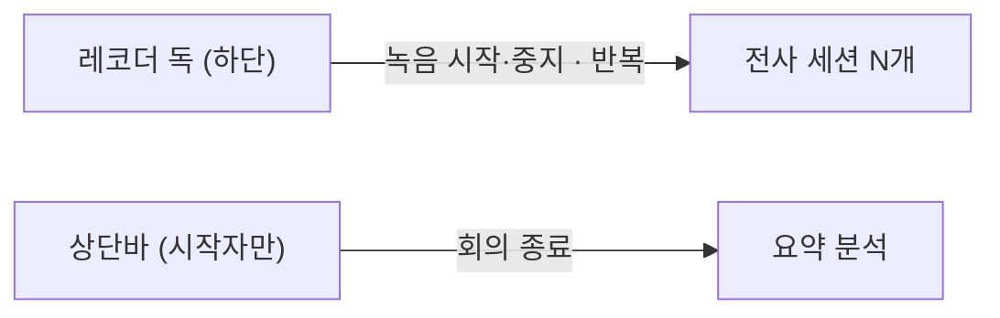

# 회의 중지·재개 UI 제거 설계 (APP-219)

## 배경

APP-218이 server에서 `MeetingStatus.PAUSED`와 `meeting-pause`·`meeting-resume`를 걷어냈다.
판단 근거(왜 축을 없앴는지)는 그쪽 설계에 있고 여기서 반복하지 않는다 —
`heymoa-server/docs/superpowers/specs/2026-07-27-app-218-meeting-paused-removal-design.md`.

이 문서는 **web에서 무엇이 어떻게 접히는가**만 다룬다.

## 목표

- 노트 상단바의 회의 조작을 `회의 종료` 하나로 줄인다.
- `paused` 파생 상태와 그것을 소비하던 분기를 없앤다.
- 계약 미러·생성 클라이언트·MSW 목을 server 산출물에 맞춘다.

## 제외 범위

- 종료된 회의에서 레코더 독이 살아 있는 문제 (APP-214, 다른 세션 진행 중).
- side 뷰에 회의 조작이 없는 문제 (APP-220).
- `mvp.pen`의 v4 세대 정리 — APP-213이 캔버스를 재구성 중이라 v5 행만 손댄다.

## 핵심 결정

### 1. `MeetingControls`가 `useRecording`을 안 본다

지금은 녹음 중이면 `회의 중지`를 `disabled`로 두고 "먼저 녹음을 중지하세요"를 안내한다.
중지 버튼이 사라지면 **그 잠금의 대상이 없어진다.**

`회의 종료`에는 같은 잠금을 걸지 않는다. 이유는 이미 `MeetingEndDialog`가 그 사유를
소유하기 때문이다 — 로컬 녹음 상태를 힌트로 쓰되 **서버의 409를 권위로 삼고**, 다른 탭·기기의
녹음까지 화면에 보이며, 상태에 따라 `stop()`/재시도/`연결 중…`으로 갈린다. 상단바에서 미리
잠그면 다이얼로그가 그 사유를 보여줄 기회 자체가 없어진다.

결과적으로 컴포넌트가 `useRecording`·`useQueryClient`·생성 훅 셋을 모두 놓는다.

### 2. `SharedChatPhase`에서 `paused`를 뺀다

`deriveMeetingPhase`가 `PAUSED`를 접던 자리가 사라진다. 소비처 셋이 같이 접힌다.

| 어디 | 무엇이 없어지나 |
|---|---|
| `shared-chat-panel` | "회의가 중지되어 있습니다 / 개인 챗봇을 이용하세요" 컴포저 안내 |
| `note-panel` | `meetingLive`의 `paused` 항 |
| `note-view` | "중지에는 개인 챗봇을 감추지 않는다" 주석 |

`ComposerNotice`가 하나 줄면서 `onOpenPersonal` prop과 `usePersonalChat()` 호출도 죽는다.
같이 지운다 — 남기면 아무도 안 쓰는 배선이 된다.

### 3. 계약 미러는 **텍스트로 편집하고 의미로 검증한다**

`openapi3.yml`은 docs repo 미러에서 `/internal/**`을 뺀 사본이다. 그런데 두 파일은 **포맷이
다르다** — web 사본은 시퀀스 들여쓰기가 한 단계 더 들어가 있어 원본 텍스트를 그대로 못 쓴다.

YAML 라운드트립으로 다시 만드는 방법은 쓸 수 없다. **JS 객체는 정수형 문자열 키를 오름차순으로
재정렬**해서 `"404"`·`"201"` 같은 응답 키 순서가 뒤집힌다.

그래서 web 사본에 **블록 단위 텍스트 편집**(경로 2개·스키마 1개·enum 값·문구)을 하고,
결과를 파싱해 **docs 미러에서 파생한 정본과 깊은 비교**로 확인했다. 파생 규칙 자체도
"이전 docs 미러에 적용하면 현재 web 사본이 나온다"는 대조로 먼저 검증했다.

이 절차는 이번 한 번의 작업이라 스크립트를 남기지 않는다 (YAGNI). 다음에 계약이 바뀌면
같은 판단을 다시 한다.

## 남는 그림

"멈춤"의 창구가 독 하나다. 상단바는 노트의 생명주기만 만진다 — 책임이 갈린다.

## 검증

- `pnpm test:run` 430 · `lint` · `typecheck` · `build` 초록
- e2e에 회귀 테스트를 남긴다 — 상단바에 `회의 종료`만 있고 `중지`·`재개`가 0개이며
  `기록 시작`은 그대로인지. 계약에서 경로가 사라졌으므로 **버튼이 남으면 404를 부른다**
- `openapi3.yml` 32경로 (34 → 32), `lib/api/generated/meeting/` 디렉토리 소멸

## 배포 — **server가 먼저다**

처음에는 "web 먼저"로 적었는데 **틀렸다.** codex 리뷰가 짚었다:
web을 먼저 올리면 기존 `PAUSED` 노트가 배포 창 내내 교착된다. 새 web은 `ENDED`가 아닌 값을
전부 `active`로 접어 공유 챗·녹음 UI를 여는데, 구 server는 둘 다 거절하고 재개 버튼은 이미
사라진 상태다.

server-first면 V16이 그 행을 즉시 되돌리고, 경로가 404라 새 `PAUSED` 행도 생길 수 없다.
구 web이 잃는 것은 눌러도 토스트만 뜨는 중지 버튼 하나 — 그것도 이번에 없애려던 버튼이다.

`deriveMeetingPhase`에 관용 분기를 넣지 않은 이유는 [`docs/codex-review-app-219.md`](../../codex-review-app-219.md)에 있다.

순서: **docs 미러 push → server 배포 → web 배포**.
