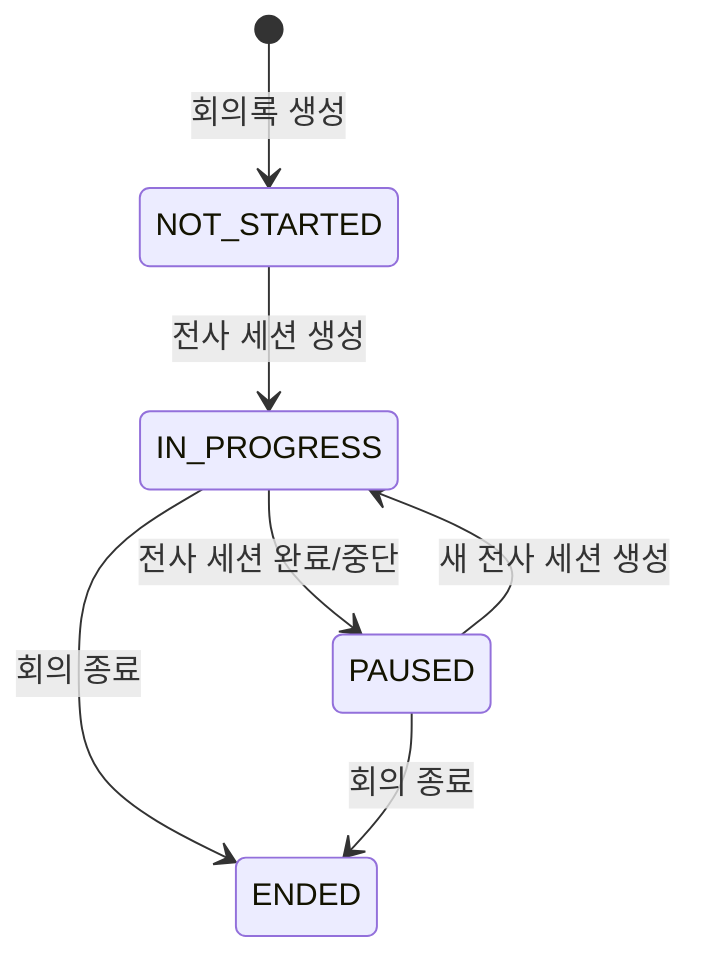

# APP-288 회의 생명주기와 기록 화면 정합화 설계

## 목표

회의록을 만든 뒤 사용자가 `시작 → 중지 → 재개 → 회의 종료`를 명시적으로 조작합니다.
서버의 회의 상태, 전사 세션, 목록과 상세의 문구가 같은 상태를 가리키며, 중지된 회의를
`진행 중`으로 표시하거나 쉬는 시간을 기록 시간에 더하지 않습니다.

## 관측한 현재 동작

- `새 노트`는 이름과 달리 노트를 만들고 side 화면으로 이동한 뒤 녹음을 즉시 시작합니다.
- 녹음의 정지 버튼은 전사 세션만 닫고 `MeetingStatus.IN_PROGRESS`를 유지합니다.
- 목록과 상세는 `meetingStartedAt`부터 현재까지를 계속 세어 중지 뒤에도 수백~수천 분을
  `진행 중`으로 표시합니다.
- 상세의 검은 `회의 종료`, 상태, 경과 시간, 확장, 닫기, `새 노트`가 같은 줄에서 경쟁합니다.

MSW 현재 full 화면을 `http://localhost:3100`에서 Pencil에 import한 baseline frame은
`H442P`(`app288/import/current/full-in-progress`)입니다. 과거 v5 frame을 덮지 않고 import가
반환한 새 ID를 이번 작업의 화면 키로 사용합니다.

## 제품 상태



| 상태 | 의미 | 표시 | 시작자 액션 |
|---|---|---|---|
| `NOT_STARTED` | 회의록만 있고 녹음을 시작하지 않음 | 시작 전 | 회의 시작 |
| `IN_PROGRESS` | 전사 세션이 열렸거나 연결 중 | 기록 중 | 중지, 회의 종료 |
| `PAUSED` | 전사 세션은 닫혔지만 회의는 끝나지 않음 | 중지됨 | 재개, 회의 종료 |
| `ENDED` | 분석을 시작한 최종 상태 | 종료됨 | 요약 보기 |

`PAUSED`는 브라우저의 로컬 추론이 아니라 서버 권위 상태입니다. 그래야 새로고침, 다른 탭,
다른 기기, 뷰어가 같은 값을 봅니다.

## 필수 전이 시나리오

| 사용자 흐름 | 상태 순서 | 화면 시간 |
|---|---|---|
| 생성만 | `NOT_STARTED` | 시작 시각 없음, 기록 `00:00` |
| 시작 → 종료 | `NOT_STARTED → IN_PROGRESS → PAUSED → ENDED` | 확인 한 번으로 내부 순차 처리, 마지막 활성 구간까지 더한 뒤 고정 |
| 시작 → 중지 | `NOT_STARTED → IN_PROGRESS → PAUSED` | 중지한 순간 고정 |
| 시작 → 중지 → 종료 | `NOT_STARTED → IN_PROGRESS → PAUSED → ENDED` | 중지 상태의 누적값 유지 |
| 시작 → 중지 → 재개 → 중지 | `NOT_STARTED → IN_PROGRESS → PAUSED → IN_PROGRESS → PAUSED` | 두 활성 구간의 합 |
| 중지/재개 반복 → 종료 | `IN_PROGRESS ↔ PAUSED → ENDED` | 모든 활성 구간만 합산, 중지·종료 뒤 고정 |

직접 종료는 web이 현재 전사 세션을 안전하게 닫고 서버의 `PAUSED`를 확인한 뒤 종료를
이어 호출합니다. 사용자 확인은 한 번이고 마지막 활성 구간도 누적 시간에서 빠지지 않습니다.
같은 상태와 시간은 목록·full·side, 시작자·뷰어, 새 탭과 새로고침에서 일치해야 합니다.

## 서버 상태 전이

별도 `meeting-pause`·`meeting-resume` 명령을 다시 만들지 않습니다. 사용자에게 녹음과 회의를
두 번 조작하게 만들면 두 상태가 다시 어긋납니다.

- 전사 세션 생성 트랜잭션이 `NOT_STARTED` 또는 `PAUSED`를 `IN_PROGRESS`로 바꿉니다.
- 정상 `completed`와 복구 가능한 `interrupted` 수명주기 처리가 `IN_PROGRESS`를 `PAUSED`로
  바꿉니다.
- `ENDED`에서는 전사 세션 생성을 거절합니다.
- 회의 종료 API는 `PAUSED`에서 실행합니다. UI가 `IN_PROGRESS`에서 종료를 요청받으면 활성
  세션 완료를 확인한 뒤 같은 확인 흐름 안에서 종료 API를 호출합니다.
- 시작 이후 조작권은 기존처럼 최초 시작자에게만 있습니다.

세션 완료와 회의 종료가 경합할 때 `ENDED`가 이깁니다. 세션 수명주기 핸들러는 이미 종료된
노트를 `PAUSED`로 되돌리지 않습니다.

### 기존 데이터

값을 삭제하거나 회의를 임의 종료하지 않고 상태만 정규화합니다.

- `ENDED`는 유지
- 시작자 없음은 `NOT_STARTED`
- 시작자 있음 + `READY/ACTIVE` 세션 존재는 `IN_PROGRESS`
- 시작자 있음 + 열린 세션 없음은 `PAUSED`

마이그레이션은 이 네 표본을 통합 테스트로 실행합니다.

## 시간 계약

화면에는 서로 다른 두 시간을 섞지 않습니다.

- `meetingStartedAt`: 최초 녹음 시작의 절대 시각
- `recordedDurationMs`: 완료된 전사 세션의 활성 구간(`endedAt - startedAt`) 합
- `activeSessionStartedAt`: 현재 열린 세션의 시작 시각. `IN_PROGRESS`가 아니면 `null`

표시 값은 다음과 같습니다.

```text
NOT_STARTED = 0
IN_PROGRESS = recordedDurationMs + (now - activeSessionStartedAt)
PAUSED      = recordedDurationMs
ENDED       = recordedDurationMs
```

상세 메타는 `7월 28일 오후 11:21 시작`처럼 절대 시각을 씁니다. 목록과 상세 어디에서도
`now - meetingStartedAt`을 회의 또는 기록 시간으로 쓰지 않습니다.

목록과 상세 응답 모두 누적 시간과 활성 세션 시작 시각을 제공해야 행별 추가 요청 없이 같은
값을 그릴 수 있습니다.

세션 생성 직후 READY/연결 중에는 `meetingStatus = IN_PROGRESS`이지만 실제 오디오 스트림이
아직 열리지 않아 `activeSessionStartedAt = null`일 수 있습니다. 이 구간은 기록 시간에서
제외하고 기존 누적값을 고정해 표시합니다. ACTIVE 전환 뒤 받은 실제 `startedAt`만 현재 구간의
기준으로 사용합니다.

### 화면별 시간 표시

| 위치 | `NOT_STARTED` | `IN_PROGRESS` | `PAUSED` | `ENDED` |
|---|---|---|---|---|
| 목록 | `시작 전` | `기록 중 · 18분` | `중지됨 · 기록 18분` | `기록 42분 · 2시간 전` |
| full/side 메타 | 생성 시각 | `7월 28일 오후 11:21 시작` | 같은 최초 시작 시각 | 같은 최초 시작 시각 |
| full/side 타이머 | `00:00` 또는 숨김 | 누적값을 초 단위 갱신 | 누적값 고정 | 최종 누적값 고정 |

목록은 초 단위 갱신으로 모든 행을 다시 그리지 않고 분 단위의 압축값을 사용합니다. 상세만
활성 상태에서 초 단위로 갱신합니다. 최초 시작 시각은 사용자의 로컬 시간대로 렌더링하며
duration 계산에는 시간대나 달력 연산을 쓰지 않습니다.

## web 데이터 흐름

### 새 노트

`새 노트`는 노트만 생성하고 optimistic 목록에 `NOT_STARTED`, 기록 0으로 넣은 뒤 full 상세를
엽니다. 마이크 권한 요청과 `recording.start()`는 `회의 시작`을 누를 때만 실행합니다.

### 시작과 재개

둘 다 `recording.start(noteId)` 한 경로를 씁니다. 서버 세션 생성 성공 뒤 exact note와 프로젝트
목록 쿼리를 invalidate해 서버 상태를 반영합니다. `PAUSED`의 시작 버튼 문구만 `재개`입니다.

### 중지

`recording.stop()`은 terminal event 또는 서버 reconcile을 확인한 뒤 transcript, exact note,
프로젝트 목록을 invalidate합니다. 화면은 서버가 반환한 `PAUSED`를 그립니다. 실패해서 열린
세션이 남으면 `중지됨`으로 낙관 전환하지 않습니다.

### 회의 종료

- `PAUSED`: 확인 뒤 종료 API를 바로 호출합니다.
- `IN_PROGRESS`: 확인 뒤 `recording.stop()`을 기다리고 종료 API를 호출합니다.
- 세션 종료 실패나 409는 다이얼로그 안에 지속 상태로 남깁니다.
- 성공 즉시 exact note와 목록 캐시를 `ENDED`로 접고 요약 탭으로 이동한 뒤 재검증합니다.

## 화면 설계

### 목록

- `NOT_STARTED`: 상태 배지 없이 보조 텍스트 `시작 전`
- `IN_PROGRESS`: 작은 red live dot + `기록 중` + 시작자 + 누적 기록 시간
- `PAUSED`: neutral/amber dot 없이 `중지됨` + 시작자 + 누적 기록 시간
- `ENDED`: live 메타를 제거하고 총 기록 시간과 상대 수정 시각

벽시계 경과는 제거합니다. 목록의 주 정보는 제목이고 상태 메타는 한 줄의 보조 정보입니다.

### full/side 상세

제목 아래 메타에 프로젝트, 생성 시각, 최초 시작 절대 시각, 누적 기록 시간을 둡니다.
상단은 상태·누적 시간과 최종 `회의 종료`를 맡고, 실제 녹음 start/stop/resume은 기존 floating
`RecordingDock` 한 곳만 맡습니다. full과 side에서 같은 규칙으로 보이며 페이지를 바꿔도
현재 노트의 로컬 녹음 컨트롤이 사라지지 않습니다.

- `NOT_STARTED`: floating primary `회의 시작`
- `IN_PROGRESS` + 현재 탭의 로컬 세션: floating `중지`, 상단 quiet destructive `회의 종료`
- `IN_PROGRESS` + 다른 탭·기기 세션: floating 설명 `다른 탭·기기에서 기록 중입니다`, 상단
  `회의 종료`는 409 안내로 수렴
- `PAUSED`: floating primary `재개`, 상단 quiet destructive `회의 종료`
- `ENDED`: floating dock 없음, 상태와 `요약 보기`

확장·닫기는 상태/종료 그룹 뒤에 hairline divider를 두고 ghost icon button으로 통일합니다.
`회의 종료`는 검은 덩어리 버튼이 아니라 outline destructive로 내려 주 행동과 경쟁하지 않게
합니다. icon-only 버튼은 항상 접근 가능한 이름과 tooltip을 가집니다.

### full 실시간 확정 전 행

현재 full 화면의 `실시간 · 확정 전` 레이블은 좁은 고정 열 안에서 글자 단위로 두세 줄이 되어
본문보다 더 시끄럽습니다. 카드와 경고색을 더 만들지 않고 기존 전사 타임라인의 임시 행으로
정리합니다.

- 왼쪽 상태는 red dot + `실시간 · 확정 전` 한 줄 칩이며 `white-space: nowrap`과 `flex: none`을
  사용합니다.
- full은 상태 열을 `max-content`, 본문 열을 `minmax(0, 1fr)`로 두어 레이블이 필요한 폭만
  차지하게 합니다.
- 전사 문장만 남은 폭에서 한국어 어절 기준으로 자연스럽게 줄바꿈합니다. 글자별 강제 줄바꿈과
  한 줄 말줄임은 사용하지 않습니다.
- 좁은 화면에서는 두 열 전체를 위아래로 쌓되 상태 칩 내부는 줄바꿈하지 않습니다.
- partial이 final segment로 확정될 때 같은 위치에서 일반 시간 행으로 바뀌며 레이아웃 폭이
  튀지 않습니다.

### 종료 확인

제목은 `회의를 종료할까요?`를 유지합니다. 기록 중이면 “현재 기록을 먼저 안전하게 저장한 뒤
회의를 종료하고 요약을 시작합니다”를 명시하고, 단일 확인 버튼이 순서를 오케스트레이션합니다.

## Pencil 왕복

1. 현재 로컬 MSW 화면을 import해 baseline key를 기록합니다.
2. 기존 토큰과 reusable component를 사용해 목록, full, side, 종료 확인을 한 화면씩 개선합니다.
3. 코드 구현 뒤 로컬 실제 화면을 같은 상태로 다시 import합니다.
4. Pencil 구조 검사와 실제 앱 스크린샷을 대조합니다.
5. 최종 import frame ID를 `docs/design-decisions.md`와 제품 화면 문서의 최신 키로 기록합니다.

Pencil의 수동 프레임과 실제 DOM import를 구분해 이름을 붙입니다. 과거 키는 삭제하지 않고
이력으로 남깁니다.

## 오류와 경쟁 조건

- start가 실패하면 상태는 서버의 이전 `NOT_STARTED/PAUSED`를 유지합니다.
- stop이 실패해 열린 세션이 남으면 `IN_PROGRESS`와 재시도 안내를 유지합니다.
- stop 성공 후 end가 실패하면 `PAUSED`로 남고 `회의 종료` 재시도를 제공합니다.
- 다른 탭이 먼저 종료하면 409/상태 refetch로 `ENDED`에 수렴합니다.
- 뷰어는 상태와 시작자만 보고 생명주기 버튼을 받지 않습니다.
- `PAUSED`와 `ENDED`에서는 공유 챗 입력과 실시간 전사 구독을 열지 않습니다.
- 기존 `recording.started`·`recording.stopped`·`meeting.ended` 이벤트는 상태 payload를
  캐시에 직접 쓰지 않고 note/list REST를 다시 읽는 신호로만 사용합니다. 별도
  `meeting.paused` 이벤트는 추가하지 않습니다.

## 제외

- 기본 `바로 회의 시작` 보조 액션
- 로컬 상태만으로 만든 가짜 `PAUSED`
- 전사 세션과 중복되는 pause/resume REST API
- main 병합, 운영 배포, 기존 회의 삭제

## 검증

- server 도메인 전이, 권한, 마이그레이션, lifecycle/end 경합 테스트
- REST Docs/OpenAPI enum·nullable·시간 의미 검증과 docs 미러 비교
- web 상태 × 역할 × full/side/list 테스트
- 새 노트 비자동 시작, 중지/재개, 기록 중 종료 E2E
- full 확정 전 행의 상태 칩 한 줄 유지, 긴 한국어 문장 자연 줄바꿈, partial→final 폭 안정성
- side에서 NOT_STARTED 시작, PAUSED 재개, 로컬 IN_PROGRESS 중지 floating dock이 항상 보이고
  다른 탭·기기 세션은 거짓 start 대신 지속 설명을 보이는지 확인
- local MSW 목록/full/side/종료 확인과 Pencil 최종 import 대조
- server `./gradlew spotlessCheck build`
- web `pnpm test:run && pnpm lint && pnpm typecheck && pnpm build && pnpm test:e2e`
- Codex `state-race-validator`: 전이 반복, 중복 요청, 다중 탭, stop/end 순서 역전,
  늦은 lifecycle event와 rollback을 독립적으로 공격
- Codex `time-ui-validator`: pause freeze/resume continuation, 마지막 활성 구간, 시간대·자정,
  목록/full/side, 권한, 반응형·접근성, Pencil/DOM parity를 독립적으로 공격
- 두 검증자의 P1/P2를 수정한 뒤 서로 다른 렌즈의 Codex 리뷰 2회
