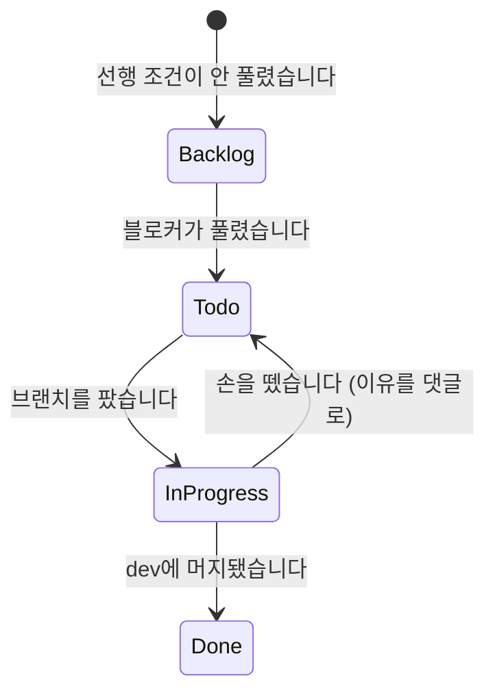

# 이슈 상태와 댓글

작업은 Linear 이슈(`APP-N`) 하나 단위입니다. 이슈를 보는 사람이 코드를 안 열고도 어디까지
왔고 무엇이 달라졌는지 알 수 있어야 합니다.

## 작업은 이슈에서 시작합니다

**번호 없이 코드를 건드리지 않습니다.** 사용자가 "이거 고쳐줘"로 시작해도 먼저 이슈를 만들고
번호를 받습니다. 오타 수정이나 문구 손질처럼 되돌리기 쉬운 잡일만 예외이고, 그때는
`chore:`·`docs:` bare 커밋을 씁니다.

이슈를 먼저 만드는 이유는 절차가 아니라 **번호가 있어야 나머지가 이어지기 때문**입니다.

### 착수 순서 — 첫 코드 수정 전에 끝내는 셋

1. **이슈를 읽고 코드와 대조합니다.** 이슈는 며칠 전 상태를 적어둔 것이라 이미 고쳐졌거나 절반만 남아 있을 수 있습니다. "할 일" 항목을 하나씩 `grep`으로 짚습니다. 남은 것이 제목과 다르면 이슈를 먼저 고쳐 씁니다
2. **상태를 In Progress로 옮기고 assignee를 채웁니다.** 브랜치를 파기 직전이 그 시점입니다
3. **브랜치를 팝니다.** `dev`를 최신으로 맞춘 뒤 `feature/app-N-slug`로 땁니다

그리고 착수 댓글(①)을 답니다.

**2를 건너뛰기 쉽습니다.** 코드부터 만지고 싶어지는데, 그러면 옆에서 보는 사람에게는 아무도
그 이슈를 안 잡은 것으로 보입니다. 이미 In Progress인 이슈를 배정받아 시작했다면 그대로
두고 넘어갑니다 — 되돌리지 마세요.

## 번호는 다섯 곳에 같이 붙습니다

| 어디 | 형식 | 예 |
|---|---|---|
| Linear 이슈 | `APP-N` | `APP-205` |
| 브랜치 | `feature/app-N-slug` | `feature/app-205-auth-session-gate` |
| 커밋 제목 | `[APP-N] 제목` | `[APP-205] 세션 게이트 추가` |
| spec·plan 파일명 | `YYYY-MM-DD-app-N-slug.md` | `2026-07-26-app-205-auth-session-gate.md` |
| 리뷰 기록 | `docs/codex-review-app-N.md` | `docs/codex-review-app-205.md` |

**한 곳이라도 빠지면 나중에 되짚을 수 없습니다.** 실제로 문서 수십 개가 번호 없이 쌓여
git log와 PR을 뒤져야 했고, 그중 일부는 PR 하나가 이슈 셋을 닫아 끝내 확정하지 못했습니다.

문서 하나가 이슈 여럿에 걸치면 **먼저 만든 이슈 번호**를 씁니다. 자세한 문서 규칙은
[`docs-layout`](docs-layout.md)에 있습니다.

## 상태 전이



**브랜치를 파는 순간** In Progress로 옮깁니다. 설계를 시작할 때가 아닙니다.
Done은 `dev`에 squash 머지된 직후입니다 — 이 레포에는 PR이 없어서 머지가 곧 완료입니다.
중간에 멈추면 Todo로 되돌리고 왜 멈췄는지 댓글을 답니다. assignee는 항상 채웁니다.

머지 전에는 `codex exec review`를 받습니다. 절차는 skill
[`merging`](../skills/merging/SKILL.md)에 있습니다.

## 댓글을 다는 다섯 순간

아래 다섯 말고는 이슈에 댓글을 달지 않습니다. 사람이 읽는 타임라인이라 도배하면 안 읽힙니다.

| 순간 | 무엇을 |
|---|---|
| ① 착수 (Todo → In Progress) | 무엇부터 볼지, 어떤 순서로 갈지. 3~5줄 |
| ② 설계 확정 (spec을 쓴 뒤) | 무엇을 정했고 무엇을 일부러 안 했나. 문서 경로를 링크합니다 |
| ③ 설계와 다르게 갔을 때 | 무엇이 달랐고 왜 바꿨나. 안 남기면 spec이 거짓말이 됩니다 |
| ④ 막히거나 우회했을 때 | 무엇이 막혔고 어떻게 돌아갔나. 남이 다시 밟지 않게 |
| ⑤ 완료 (Done으로 옮기며) | 실제로 무엇이 됐고 무엇이 안 됐나. 머지 커밋 링크 |

③과 ④는 발견한 그 자리에서 답니다. 나중에 몰아 쓰면 왜 그랬는지를 잊습니다.

작업 중에 후속이나 블로커를 발견하면 댓글로 끝내지 말고 이슈로 만듭니다. 되돌리기 어렵거나
흐름을 끊는 것만이고, 사소한 건 인라인으로 고칩니다.

## 쓰는 법

사람이 읽으니 존댓말로 씁니다. 흐름이나 구조가 바뀌었으면 mermaid 한 장을 넣습니다.
"구현했습니다"만 쓰지 말고 무엇이 달라졌는지를 씁니다.
⑤에서 "안 된 것"이 비어 있으면 대개 안 본 것입니다. 정말 없으면 없다고 적습니다.

```markdown
머지: <커밋 링크>

**된 것**
- 무엇이 실제로 동작합니다 (검증한 방법을 한 줄로)

**안 된 것**
- 무엇이 왜 남았습니다. 후속 이슈가 있으면 링크

**설계와 달라진 것**
- 없으면 "없습니다"라고 적습니다
```

## 어긋났을 때 알아채는 법

머지했는데 이슈가 Todo이면 상태 전이를 빠뜨린 것입니다. 댓글 하나 없이 Done이면 무슨 일이
있었는지 아무도 모릅니다. spec과 코드가 다른데 ③이 없으면 다음 사람이 spec을 믿고 틀립니다.
